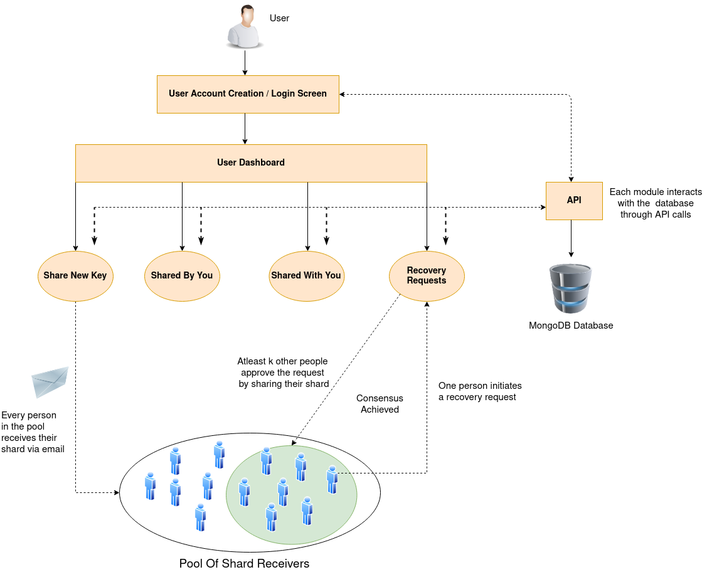

<h1 align="center">
  <br>
  <a href="https://shardshare-frontend.herokuapp.com/"></a>
  <br>
  ShardShare
  <br>
</h1>

<h4 align="center">A consensus-based credential sharing application based on <a href="https://en.wikipedia.org/wiki/Shamir%27s_Secret_Sharing" target="_blank">Shamir's Secret Sharing Scheme</a></h4>

<h4 align="center">Created By <a href="https://github.com/hrishikeshathalye" target="_blank">Hrishikesh Athalye</a> & <a href="https://github.com/nachiket59" target="_blank">Nachiket Pethe</a> </h4>

<b><h3 align="center">Try the project live <a href="https://shardshare-frontend.herokuapp.com/" target="_blank">here</a></h3></b>

<p align="center">
  <a href="#about">What Is ShardShare?</a> •
  <a href="#architecture">How It Works</a> •
  <a href="#installation">Installation</a> •
  <a href="#Demo">Demo</a> •
  <a href="#report">Final Report</a> •
  <a href="#credits">Credits</a> •
  <a href="#developers">Developers</a> •
  <a href="#license">License</a>
</p>

## About

ShardShare is an application that uses Shamir's Secret Sharing Scheme to split a secret credential (i.e. a password, Bitcoin private key, etc) into n parts such that atleast k parts are needed to recover the secret. Each of these n parts do not make sense on their own and are "information-theoretically secure" - which means that knowing less than the requisite number of shares is the same as knowing none of the shares. This makes this technique incredibly powerful in the safeguarding of secrets.
This is typically useful for sharing keys like cryptocurrency wallet passwords where a "reset password" feature isn't available. In recent times, many people have been locked out of their fortune due to losing passwords of such wallets. For situations like these, using something like Shamir's secret sharing is the best bet to keep the secret recoverable by decentralising it by sharing it with a number of people. It is also secure since no person who has a part of the secret actually knows the entire secret.

## Architecture



## Installation

To clone and run this application, you'll need [Git](https://git-scm.com) and [Node.js](https://nodejs.org/en/download/) (which comes with [npm](http://npmjs.com)) installed on your computer. From your command line:

```bash
# Clone this repository
$ git clone https://github.com/hrishikeshathalye/ShardShare

# Go into the repository
$ cd ShardShare

# Install frontend dependencies
$ cd frontend && npm install

# Install backend dependencies
$ cd backend && npm install

# Create a .env file
$ cd into backend and create a .env file containing the following fields:

  PORT=5000
  REFRESH_TOKEN=<Refresh Token for Google OAuth>
  REDIRECT_URL=<Redirect URL for Google OAuth>
  CLIENT_ID=REDIRECT_URL=<Client Id for Google OAuth>
  CLIENT_SECRET=<Client Secret for Google OAuth>
  EMAIL=<Gmail email address to be used to send emails from>
  MONGO_URL=<MongoDB Atlas connection string>

# Run the backend
$ cd backend && npm start

# Run the frontend
$ cd frontend && npm start
```

Once the installation is done the app will be accessible on localhost:PORT. The app is PWA-compatible (tested using Google Lighthouse) and if hosted, it can very easily be accessed from a phone and be installed as a PWA.

Note: If you're using Linux Bash for Windows, [see this guide](https://www.howtogeek.com/261575/how-to-run-graphical-linux-desktop-applications-from-windows-10s-bash-shell/) or use `node` from the command prompt.

## Demo


## Report

[Final Report](https://pdfhost.io/v/u132EReWx_Final_Reportpdf.pdf)

## Credits

This software uses the following open source packages:

- [Node.js](https://nodejs.org/)
- [React.js](https://reactjs.org/)
- [secrets.js](https://github.com/grempe/secrets.js)

## Developers

- [Hrishikesh Athalye](https://github.com/hrishikeshathalye)
- [Nachiket Pethe](https://github.com/nachiket59)

## License

GNU GPLv3
